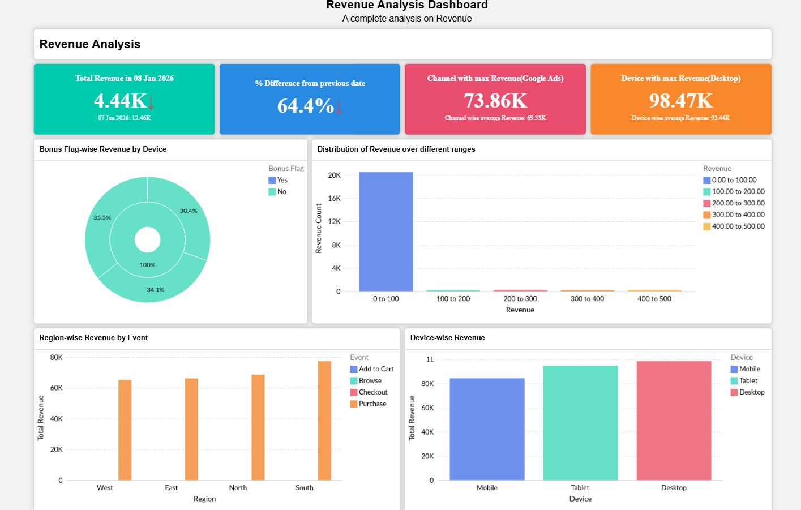
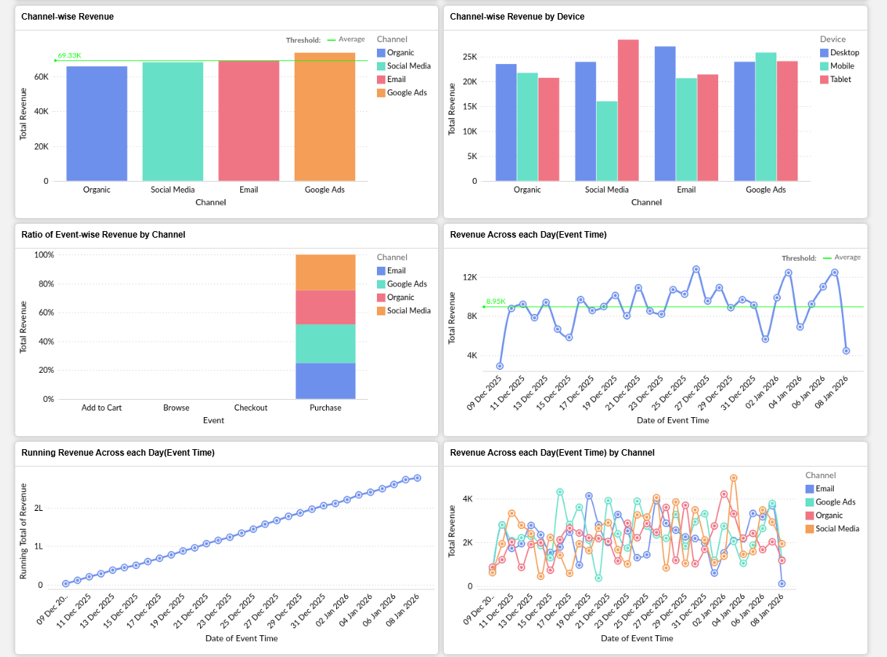
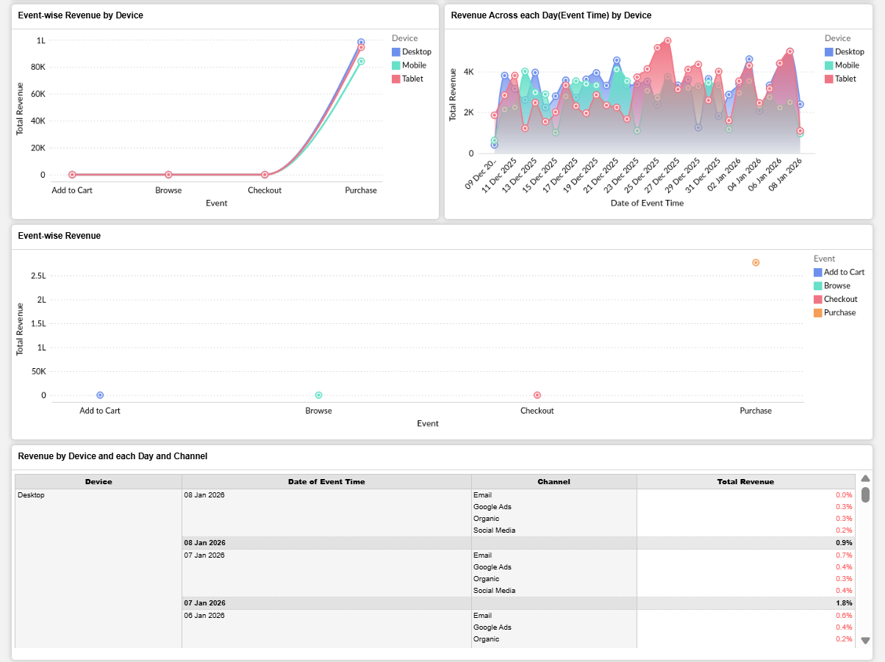

# 📊 Marketing Funnel & Conversion Performance Analysis

**Future Interns — Data Science & Analytics | Task 3**
**GitHub Repository:** `FUTURE_DS_03`

---

## 📸 Dashboard Preview

### Page 1 — Revenue Analysis

### Page 2 — Channel & Time Analysis

### Page 3 — Event & Device Deep Dive

---

## 📁 Dataset Overview

| Detail | Value |
|---|---|
| Total Events | 21,409 |
| Total Revenue | $277,323 |
| Top Channel | Google Ads ($73.8K) |
| Top Device | Desktop ($98.47K) |
| Top Region | South |
| Date Range | Dec 2025 – Jan 2026 |

**Columns:** User ID, Session ID, Event Time, Event,
Device, Region, Channel, Product Category, Revenue, Bonus Flag

**Funnel Stages:** Browse → Add to Cart → Checkout → Purchase

---

## 🔍 Key Insights

1. **Purchase is the only revenue-generating event** —
   Browse, Add to Cart and Checkout contribute $0 revenue
2. **Google Ads is the best channel** — only channel
   exceeding the $69.33K average threshold
3. **Desktop dominates** — $98.47K revenue vs lower
   figures on Mobile and Tablet
4. **South region leads** all other regions in total revenue
5. **Revenue peaked 25 Dec 2025** — festive season spike
6. **Checkout drop-off is critical** — most users never
   reach the Purchase stage

---

## ✅ Recommendations

| Priority | Action |
|---|---|
| HIGH | Fix checkout — guest login, 1-click payments |
| HIGH | Retarget cart abandoners via email within 1 hr |
| MEDIUM | Scale Google Ads — best ROI channel |
| MEDIUM | Mobile UX audit — Desktop earns significantly more |
| LOW | Run festive campaigns in December |
| LOW | Focus regional campaigns on South |

---

## 🛠️ Tools Used

- Microsoft Power BI — dashboard & visualizations
- Python (pandas) — data exploration & analysis
- GitHub — project documentation & portfolio

---

## 🎓 Internship Details

- **Program:** Future Interns — Data Science & Analytics
- **Track Code:** DS
- **Task Number:** 3
- **Repository Name:** FUTURE_DS_03

---
